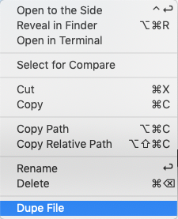

# Dupe File

Adds right-click "Dupe File" to the context menu in the file view.



## Usage

The first option:

  1. Hover on a file or directory name in explorer.
  2. Right-click and select `Dupe file`.

The second option:

  1. Open the file.
  2. Press `F1` and select `Dupe file`.


## Supported settings

#### dupe.openFileAfterCopy

  * Type: `Boolean`
  * Default: `false`

Opens the newly created file immediately.

## Keyboard shortcuts

For changes keyboard shortcuts, create a new rule in `File -> Preferences -> Keyboard Shortcuts`:

```json
{
  "key": "ctrl+shift+d",
  "command": "dupe.execute"
}
```


## License

This software is released under the terms of the MIT license.

## Special Props

Thanks to [Dennis Malinochkin](https://mrmlnc.com/) for leading the way with a similar project [Duplicate action](https://github.com/mrmlnc/vscode-duplicate/)

## Changelog

v1.0.6 - 2019-10-20 @ 12:45:03
- fixed honoring settings

v1.0.5 - 2019-10-20 @ 12:28:16
- fix references

v1.0.2 - 2019-10-20 @ 03:20:55
- initial release
